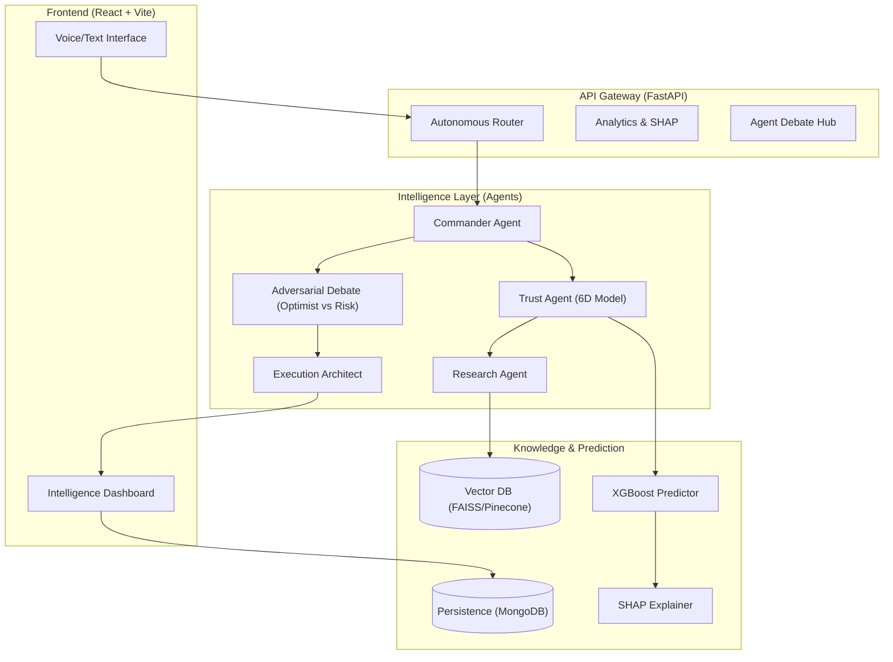

# 🛡️ AegisAI: Autonomous Decision Intelligence

**Trust-Aware Multi-Agent Orchestration & Strategy Engine**

[](https://opensource.org/licenses/MIT)
[](https://www.python.org/downloads/)
[](https://fastapi.tiangolo.com/)
[](https://reactjs.org/)

AegisAI is a production-grade autonomous system designed to transform vague goals into high-confidence execution plans. By leveraging an **adversarial multi-agent architecture** and a **mathematical trust framework**, AegisAI ensures every decision is feasible, risk-aware, and fully explainable.

---

## 🏗️ System Architecture

AegisAI bridges the gap between raw LLM reasoning and structured execution through a sophisticated hybrid pipeline.



---

## 🧬 The 8-Stage Intelligence Pipeline

Every mission is processed through a rigorous pipeline to eliminate bias and maximize success.

1.  **Commander Agent**: Decomposes goals into actionable subtasks.
2.  **Trust Engine**: Audits claims using the **6D Trust Formula**.
3.  **Semantic Retrieval**: Pulls historical context from vector memory.
4.  **ML Success Predictor**: Runs XGBoost models to calculate success probability.
5.  **SHAP Explainability**: Analyzes feature impact on the decision.
6.  **Adversarial Debate**: Triggers an "Optimist vs Risk Analyst" conflict resolution.
7.  **Execution Architect**: Generates a dependency-aware execution graph.
8.  **Reflection & Memory**: Stores outcomes to improve future performance.

---

## 📈 The 6D Trust Model

Decisions are validated across six critical dimensions:

| Dimension | Weight | Description |
| :--- | :--- | :--- |
| **Goal Clarity** | 15% | Specificity and measurability of the input. |
| **Info Quality** | 20% | Accuracy and depth of retrieved context. |
| **Feasibility** | 25% | Technical and operational logic of the plan. |
| **Risk Control** | 15% | Manageability of identified blockers. |
| **Resources** | 15% | Adequacy of budget, team, and tools. |
| **Uncertainty** | 10% | Impact of external/market variables. |

---

## 🛠️ Technology Stack

-   **Backend**: Python 3.11, FastAPI, Uvicorn.
-   **Intelligence**: Groq (Llama-3.3 70B), OpenRouter Fallback.
-   **Machine Learning**: XGBoost (Prediction), SHAP (Explainability).
-   **Memory**: MongoDB (History), Redis (Cache), FAISS/Pinecone (Vector).
-   **Frontend**: React 18, Vite, TailwindCSS, Framer Motion, Mermaid.js.
-   **Voice**: Sarvam AI (Indic Language STT/TTS).

---

## 🚀 Quick Start

### 1. Prerequisites
- Python 3.10+
- Node.js 18+
- MongoDB & Redis (local or cloud)

### 2. Backend Setup
```bash
# Create virtual environment
python -m venv venv
source venv/bin/activate  # Windows: venv\Scripts\activate

# Install dependencies
pip install -r requirements.txt

# Configure environment
cp .env.example .env
# Add your API keys to .env
```

### 3. Frontend Setup
```bash
npm install
```

### 4. Run AegisAI
```powershell
# Run the integrated startup script (Windows)
.\start.ps1
```

---

## 📂 Project Structure

```text
├── agents/             # Specialized AI reasoning agents
├── core/               # Pipeline orchestration & logic
├── services/           # External service integrations (Groq, MongoDB, etc.)
├── routers/            # FastAPI endpoint definitions
├── models/             # ML models and data schemas
├── scripts/            # Training and utility scripts
├── src/                # React frontend source code
└── tests/              # Comprehensive test suite
```

---

## 🔒 Security & Privacy

-   **Zero Leak Policy**: All API keys are loaded via environment variables.
-   **Sandboxed Execution**: Subtasks are executed in isolated environments.
-   **Traceability**: Every decision is logged with full reasoning traces.

---

MIT © 2024 AegisAI Decision Systems
